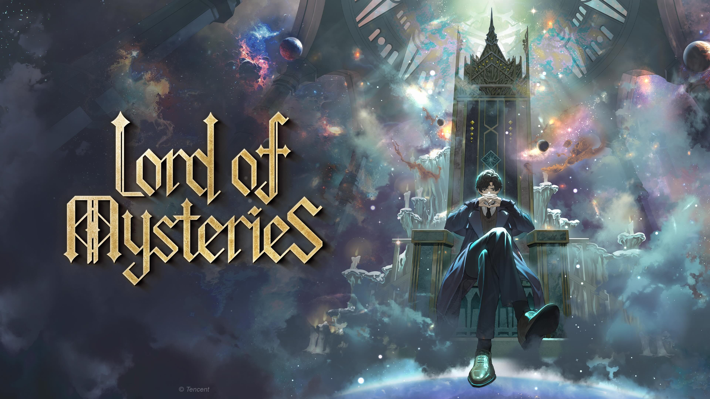

# Lord of Mysteries — TTRPG Wiki

A web-based reference wiki for a fan-made *Lord of Mysteries* TTRPG system, built for GMs and players at the table. Fast lookup for pathways, sequences, Beyonder abilities, character statblocks, and game rules.

**Live site:** [https://oprinandrei.github.io/LOTM-TTRPG-wiki](https://oprinandrei.github.io/LOTM-TTRPG-wiki)

---

## Inspiration & Community

This project is inspired by the excellent community rulebook assembled here:

> [Complete TTRPG Rulebook for LOTM (Corrected)](https://www.reddit.com/r/LordofTheMysteries/comments/12qzixe/complete_ttrpg_rulebook_for_lotm_corrected/) — r/LordofTheMysteries

Everyone is welcome to contribute, fork, or freely use this project — no restrictions, no conditions. If you want to adapt it for your own group, translate it, extend it, or build on top of it, go ahead.

---

## Disclaimer

This project has no affiliation with the *Lord of Mysteries* trademark, its original author (Cuttlefish That Loves Diving / 爱潜水的乌贼), or any official rights holders. This is purely fan content, created with no monetization in mind. A fan built this to help themselves and their players better understand and enjoy the TTRPG system.

---

### The World of Lord of Mysteries

Picture Victorian England: a world of surface prosperity concealing deep inequality. Nobles and the wealthy hold power, while countless poor are quietly crushed beneath society's weight.

In this world, **gods truly exist**. There are seven Righteous Gods — beings capable of maintaining their own sanity, with established churches and believers across nations.

### The Hidden World

The supernatural is real — but ordinary people don't know it. Society's surface remains ignorant, with the mystery hidden behind a curtain. Through chance and coincidence, ordinary people sometimes brush against the extraordinary and are drawn in. Those who take potions are called **Beyonders**, and they gain supernatural powers derived from Beyonder Characteristics — fragments of the world's original creator, dispersed when it fell.

### The Heart of This World

The world of *Lord of the Mysteries* is not just a backdrop for supernatural adventure. Beneath the extraordinary, it is about the **tension between humanity and divinity** — the weight of being powerful in a world that grinds ordinary people to dust.

God is not omnipotent here. The gods of this world are not all-knowing, all-powerful, or particularly caring. Even as a Beyonder, you've only gained a *chance* to change things. Whether you actually do depends entirely on whether you grab hold of it.

**If you're ready, you can begin exploring this mysterious and extraordinary world.**

---

Built with [Astro](https://astro.build) · Hosted on [GitHub Pages](https://pages.github.com)
